# Navigation map — every state, page, and button edge

The complete navigation graph of the tier-1 watch firmware: which surfaces
exist, every button edge between them, and the computed press-cost of getting
anywhere. Sources of truth: `watch_core::button` (press grammar),
`watch_core::page` (cycle order, §286), `watch_core::page_grid` (the grid
modal, §288/§289/§333), `watch_core::record` (run states), `watch_core::face`
(what each surface renders), `watch_core::settings_menu` (the idle menu, §351), `watch_core::erase` (the
§378 factory-erase guard),
`watch_core::screens` (what a composed data screen holds, §364). Every edge below is host-tested; the flows are
sim-verified (see `apps/custom_watch/local_testing.md` for the macros).

## Mode-level graph

```mermaid
stateDiagram-v2
    direction LR
    Idle: Idle face (home)
    Idle: clock hero + HR / ALT
    Idle: GPS glance + GNSS mode
    Diag: Diagnostics face
    Diag: LAT / LON / SPD
    Diag: seconds clock / vert
    Ice: ICE / medical ID face (§358)
    Ice: name / blood / conditions
    Ice: emergency contact + number
    Run: Run view
    Run: 41 built-in pages + up to 4 composed (§364), filtered mask
    Grid: Page grid (modal)
    Grid: button legend + cursor page name
    Grid: one screenful of enabled pages + cursor
    Menu: Settings menu (modal, §351)
    Menu: GNSS mode / hide empty / profile
    Menu: backyard / erase / re-zero / medical ID
    Tmr: Timer (modal, §375)
    Tmr: countdown / stopwatch, one ladder

    [*] --> Idle
    Idle --> Idle: BTN3 tap — GNSS mode cycle
    Idle --> Idle: BTN3 hold — QNH re-zero
    Idle --> Diag: BTN4 — diagnostics view (§291)
    Diag --> Ice: BTN4 — medical ID (§358)
    Ice --> Idle: BTN4 — back to home
    Ice --> Run: BTN1 — start run
    Diag --> Run: BTN1 — start run
    Idle --> Menu: BTN5 — settings (§351)
    Idle --> Tmr: BTN2 — timer (§375)
    Tmr --> Tmr: BTN1 — start / stop / resume
    Tmr --> Tmr: BTN2 / BTN3 — preset longer / shorter
    Tmr --> Tmr: BTN5 — reset (stopped only)
    Tmr --> Idle: BTN4 — exit (the timer keeps running)
    Tmr --> Idle: 30 s inactivity — auto-close
    Menu --> Menu: BTN2 / BTN3 — cursor up / down (the UP / DOWN slots)
    Menu --> Menu: BTN5 / BTN1 — edit left / right (off-on, dec-inc)
    Menu --> Idle: BTN4 — exit (the BACK slot)
    Menu --> Idle: BTN1 on RE-ZERO — fire + close
    Menu --> Ice: BTN1 on MEDICAL ID — show + close
    Menu --> Menu: BTN1 on FACTORY ERASE — arm ("ERASE ALL? B1", 4 s)
    Menu --> Menu: BTN1 x2 — wipe (§378); the menu stays open on factory values
    Menu --> Menu: any other press, or 4 s — cancel the arm
    Menu --> Idle: 30 s inactivity — auto-close
    Idle --> Run: BTN1 — start run
    Run --> Run: BTN1 — pause / resume (REC / PAU / AUTO tag)
    Run --> Run: BTN2 — arm stop ("STOP? BTN2" banner, 4 s)
    Run --> Run: BTN2 x2 — stop (FIN)
    Run --> Run: BTN5 tap — lap (REC / PAU); skips the workout step when one is armed (§354)
    Run --> Run: BTN5 held 0.5 s — mark a waypoint (§357)
    Run --> Run: BTN3 tap / BTN4 tap — page left / page right
    Run --> Grid: BTN3 or BTN4 held 0.5 s — grid opens at the threshold
    Grid --> Grid: BTN4 tap / hold — cursor +1 / +4
    Grid --> Grid: BTN3 tap / hold — cursor -1 / -4
    Grid --> Run: BTN1 — jump to cursor (B1 GO)
    Grid --> Run: 3 s inactivity — auto-jump to cursor
    Grid --> Run: BTN2 — cancel (swallowed)
    Run --> Idle: BTN1 from FIN — dismiss home
```

Run sub-states (the tag top-right of every run page): `REC` blinking while
recording (steady through the min-move sampling artifact on slow climbs),
`AUTO` steady during an auto-pause — speed-derived, or the fixes drying up
past `fix_interval_s * 3` (min 10 s), since a void that kept reading `REC`
would claim to be tracking a runner it had lost (§367); both resume
themselves, `PAU`
steady only for a manual pause (owes a BTN1 press), `FIN` once stopped
(decisions §287). `BTN1` from `FIN` returns home and the next run opens on
the Dashboard (§289) — before §289, `Finished` was a dead end that held the
run view until reboot. Every run view — recording, paused, finished — pages
the same way: BTN3 tap left, BTN4 tap right (§350, superseding §290's
FIN-only tap-back). Dismissing also resets the idle face to the home view,
wherever a pre-run BTN4 walk left it (§291, widened to three faces by §358).

BTN5 grew a hold tier mid-run (§357): the tap is still the lap (and still the
workout-step skip when one is armed, §354), and holding it past the same
0.5 s boundary the paging keys use marks the current position as a waypoint.
It was the one gesture the §350 grammar had left free, and it fires at the
threshold while still held, exactly like the grid-open hold — no release is
ever timed blind. A mark never moves the view: the runner is holding BTN5
while reading some other page, and being yanked onto the Waypoint page would
cost a press to undo.

**BTN5 grew no third meaning for the backyard (§372).** In that mode its tap
is still exactly the lap it always was — the mode simply *reads* the lap the
press already closes as the runner's corral return, so a backyard runner's
whole interaction with the format is the same key they would press anyway.
The per-loop reset rides the same machinery from the other side: while the
mode is armed the auto-lap fires on the corral bell instead of at 1 km, so a
runner who marks nothing still gets one lap per hour and the loop count
cannot silently merge two loops into one.

## The page cycle (§286 order, §284 filter)

The paging pair walks this ring the way it is drawn — the ring renders
horizontally (the top-edge position thumb), so the lower-RIGHT key (BTN4)
taps rightward and the lower-LEFT key (BTN3) taps leftward (§350), and both
walks are filtered to `pages_mask` (data-present ∩ curated, Dashboard always
enabled). Clusters are ordered by mid-run glance frequency; `GUID` (the
scripted coach run) closes the live cluster as the virtual partner's sibling,
and `BACK` (Back-to-start) sits last so the safety page is exactly one
left-tap from home. `WKT` (the pushed structured workout, §354) closes the
live cluster beside `GUID`, its scripted sibling; `CLMB` (the §359 climb /
crest view) *heads* the course cluster, because on a mountain course it is
the question asked most; `SLP` (the §373 sleep-station nap budget) sits
immediately after `CUT`, because it IS that page's margin less a safety
reserve — a runner reading `TIGHT` is one tap from what it costs them in
sleep, and the two pages come and go together off one projection; `TIMR` (the
§375 countdown / stopwatch), `SUN` (the Daylight sunset countdown, §355) and
`WPT` (the §357 marked waypoint) close the back half just ahead of `BACK`,
which `WPT` sits beside deliberately — the two pages answer the same "which
way, how far" question about different anchors, and `TIMR` heads that trio
beside `SUN` for the same kind of reason: both are countdowns, one the runner
set and one the sky did. The curation mask has been
64-bit on the wire since `SET1` v4 (§336), so every page the enum declares —
including `BACK`, and the pages a pre-v4 phone's 32-bit mask cannot name,
which `mask_from_wire` leaves *enabled* rather than hiding invisibly (§333)
— is addressable by a current push. Data presence still gates them all.

```mermaid
flowchart LR
    subgraph live [live run]
        DASH --> SC1 --> SC2 --> SC3 --> SC4 --> DIST --> PACE --> LAP --> YARD --> ZONE --> SPLT --> PACR --> GUID --> WKT
    end
    subgraph course [course / race ops]
        CLMB --> NAV --> TURN --> CUT --> SLP --> ROAD --> FUEL
    end
    subgraph effort [effort analysis]
        ELEV --> PRED --> LOAD --> BAND
    end
    subgraph synced [synced training]
        GEAR --> TPCE --> FITN --> REDY --> GOAL --> RDAY --> PLAN --> ADPT
    end
    subgraph summaries [synced summaries]
        RCAP --> STRK --> STAT --> PR --> SMPL --> RELV --> AEFF --> TIMR --> SUN --> WPT
    end
    WKT --> CLMB
    FUEL --> ELEV
    BAND --> GEAR
    ADPT --> RCAP
    WPT --> BACK
    BACK --> DASH
```

`SC1`–`SC4` are the runner's own composed data screens (§ 364). They seat
immediately after the Dashboard — a screen you built is one press from home —
and each is gated on having actually been composed, so a watch that has never
been pushed an `SCR1` frame walks straight `DASH --> DIST` and the ring is
exactly the 41 built-ins. `BACK` stays last in every case.

`YARD` is the backyard-ultra page (§ 372) and sits beside `LAP` because in
that mode the lap IS the loop — the corral bell closes it. It carries no
data-presence bit of its own: it is in the cycle exactly while the mode is
armed, and off it entirely otherwise, so an ordinary run never meets it.

The page grid (hold either paging key 0.5 s — it opens at the threshold, so
the grid appearing is the hold's own feedback) shows this same ring as a
4-column map — codes in cycle order, cursor box on the current page — and
moves over it with `±1` (taps) and `±4` (holds), BTN4 forward and BTN3
backward: the same directions the keys page, so the modal never inverts the
spatial mapping. Above the map sit two chrome rows: row 0 is the **button
legend** (`B2 EXIT` … `B1 GO`) and row 1 the **cursor page's full
name** (`Page::name`, longest `ELEVATION PROFILE` at 17 of 21 cells). The body
therefore seats `GRID_CAPACITY` = 4 × 7 = 28 cells against a 41-page ring, so it
is a **window** that scrolls in whole rows to keep the cursor's row on screen
rather than truncating the tail (§333) — scroll depth `ceil(41/4) − 7` = 4 at
the full built-in mask, and 5 on a watch carrying all four composed screens
(`ceil(45/4) − 7`). Under the everyday filtered mask (~12 pages, 3 rows) the
whole enabled set fits and nothing scrolls.

The chrome is what makes the modal honest about itself. 41 codes need
`ceil(41/4)` = 11 rows against a panel of 9 (144 px / 16 px) — 12 at 45 — so the ring has
not merely filled the screen — it now outruns it even with no chrome at all,
which is precisely what §333's window was built for. Every chrome row is
bought from body capacity, which only
§333's window makes affordable (before it the body was a hard 32-cell `const`
assert). Row 0 names BTN2 and BTN1 and deliberately **not** BTN3/BTN4: a paging
press moves the visible cursor one cell in the direction it always pages and
commits nothing, so it is discovered for free, whereas BTN2 — which arms the
stop everywhere else and cancels in here — is a *safety* remap the closing grid
cannot reveal (§337), and `B1 GO` names the confirm because a START-key jump is
learned from other watches, not from this screen.

## The settings menu (idle, §351 — directional key map)

A BTN5 tap on the idle face opens it — the lap key is dead while idle, the
same dead-key repurposing as §290/§291. Inside, every key is spatially true
to the case:

- **BTN2 / BTN3** — cursor **up / down** the list. These are the §81 slots
  Garmin literally names UP and DOWN, stacked vertically on the left of the
  case.
- **BTN5 / BTN1** — edit the selected row, **left / right**: left = off /
  decrease, right = on / increase, and right fires an action row. Edits are
  directional and idempotent — HIDE EMPTY is right=ON / left=OFF (the side
  you want, never an overshootable toggle), GNSS MODE is a clamped ladder
  (right toward Expedition and more hours, left toward Performance and more
  fixes, no wrap) with the projected hours read *before* committing.
- **BTN4** — **exit**, on the §81 BACK slot, where every five-button watch
  puts it.

Seven items at tier 1: **GNSS MODE**, **HIDE EMPTY** (the §284 filter; the
full per-page mask stays a phone surface), **PROFILE** (§353 — the Run →
Trail → Ultra → Hike ladder, right toward the longer / more-battery
activities, clamped; selecting a rung *applies* its preset — a curated page
mask plus a GNSS mode — through the same channels a phone push and the quick
cycle ride, and the row shows the last-applied profile, `--` until one is
ever chosen), **BACKYARD** (§372 — right=ON / left=OFF, the HIDE EMPTY
grammar; arming it puts the `YARD` page in the cycle and re-points the
auto-lap from 1 km onto the corral bell, which is why it is idle-only: a run
has to be wholly inside the mode or wholly outside it), **FACTORY ERASE**
(§378 — the wearer's own wipe, and the one row that is *guarded*: right arms
it and a second right inside the stop guard's own 4 s window fires, with any
other press cancelling; see below), **RE-ZERO ALTITUDE**
(right fires the idle hold's request and closes; the idle banner answers),
**MEDICAL ID** (§358 — right closes the menu onto the ICE face, the same
action-row shape; the card itself is the only useful confirmation the row did
anything). The BTN4 idle walk reaches
that face too, but only for someone who already knows it is there — the
named row is how a runner discovers the card exists and checks it before a
race. Value rows keep the menu open — the row
re-rendering with the new value is the confirmation. Every press inside is
swallowed, the menu is idle-only, and 30 s of inactivity closes it because it
covers the home clock. The GNSS mode, the hide-empty choice, the profile
selection and the backyard arm all persist in the CFG1 flash record and
restore at boot (the profile restore re-applies its page preset) — whichever
side wrote last, menu or phone push, wins the reboot. The erase is the one
action row that **stays open**, because the menu is its own confirmation: the
rows above it redraw at their factory values (`GNSS PERF EST 110H`,
`PROFILE --`, `BACKYARD OFF`) on the screen the runner pressed from.

**The §351 cost bound has now survived a sixth AND a seventh row, and both
amendments are worth stating precisely.** The original wording said a sixth
item would break the "≤ 2 cursor steps, so ≤ 4 presses" bound. It does not,
because the row went in at index 3 — the ring's far point — and a 6-ring's
step distances from the cursor's home are `[0,1,2,3,2,1]` against the
5-ring's `[0,1,2,2,1]`: **every pre-existing row keeps its exact cost**, and
the new maximum of 3 steps (5 presses) belongs to the one row a runner touches
once per race rather than once per hour. That is the real budget: not the row
count, but that no row a runner reaches for *mid-race* costs more than 4
presses.

**This section then predicted that "a seventh item would raise an existing
row's cost". That was wrong, and §378 records why: it assumed appending.** A
wrapping ring's cursor distance to index `k` is `min(k, n-k)`, so a 6-ring has
**one** far seat at 3 while a 7-ring has **two** — `[0,1,2,3,3,2,1]`. The
seventh row takes the *second* far seat and displaces nobody. §378's FACTORY
ERASE went in at **index 4**, and every pre-existing row keeps its exact
distance:

| Row | 6-ring index / steps | 7-ring index / steps |
|---|---|---|
| GNSS MODE | 0 / 0 | 0 / 0 |
| HIDE EMPTY | 1 / 1 | 1 / 1 |
| PROFILE | 2 / 2 | 2 / 2 |
| BACKYARD | 3 / **3** | 3 / **3** |
| FACTORY ERASE | — | 4 / **3** |
| RE-ZERO ALTITUDE | 4 / 2 | 5 / 2 |
| MEDICAL ID | 5 / 1 | 6 / 1 |

Appending at index 6 is the one placement that would have cost anything
(RE-ZERO 2→3, MEDICAL ID 1→2) — and it is also the *cheapest* seat on a
wrapping ring, one BTN2 press from home, which is exactly wrong for a wipe. A
test computes both rings from `ITEMS` and fails on a reorder that taxes a
mid-race row.

**The layout, though, really did have to change, and it spends the last
slack.** Six rows under two chrome rows and a blank spacer filled the 9-row
panel exactly (a test pins `MENU_TOP_ROW + MENU_ITEMS == ROWS`). §378 moves
`MENU_TOP_ROW` 3 → 2 and the spacer is gone; the list stays legible because
every item row is indented two cells behind its cursor marker while the title
is flush left, so the indentation does the separating the blank row did. An
**eighth** row has nothing left to reclaim and needs §333's row-scrolling
window ported from the grid.

The menu's key map deliberately diverges from the grid's (BTN3/BTN4 cursor,
`B1 GO`, `B2 EXIT`): the grid walks the *horizontal* page ring, so its cursor
rides the paging pair; a settings list is *vertical* with a value axis across
each row, so its cursor rides the vertical pair and its edits the horizontal
one. Each modal is true to what it shows. The one §337-class surprise — EXIT
living on B4 here but B2 there — is what the menu's legend row names
(`B5- B1+       B4 EXIT`); the cursor keys move a visible marker and stay
unlabelled.

## The timer (idle, §375 — the third modal)

A **BTN2 tap on the idle face** opens it. That was the last dead key in the
§350 grammar — the stop has no run to end while idle, exactly as the lap has
no lap to take (§351) and BTN4 no page to turn (§291) — so the modal costs no
existing gesture. A modal rather than a tap/hold split on BTN2 because *idle
gestures are duration-stable* is an invariant below, and splitting BTN2 by
duration would have been the first idle gesture to break it.

Inside, the same rule as the settings menu, applied to a different shape:

- **BTN1** — **start / stop / resume**, the §81 START slot, the same context
  verb that key carries in every run view.
- **BTN2 / BTN3** — the preset one rung **longer / shorter**. The settings
  menu's vertical *cursor* pair, carrying a *value* here because this modal
  shows one instrument and has no list to walk — each modal true to what it
  shows, which is §351's own rule. The ladder is clamped (no wrap-teleport)
  and **refused once the timer is armed**: moving the target under a running
  countdown would silently shift an expiry the runner is already timing
  against.
- **BTN5** — **reset**, refused while running. Stopping first is one extra
  press and it is the `StopGuard` trade at a much smaller stake: a brushed
  sleeve may not zero a live timing.
- **BTN4** — **exit**, the §81 BACK slot, where the settings menu already
  puts it. Deliberately not a third exit key: §337's rule is about surprises,
  and the grid's B2 is already one remap a runner has to read.

One ladder, eleven rungs: `0` (which *is* the stopwatch — with nothing to
count down to it counts up), then 1 / 3 / 5 / 10 / 15 / 20 / 30 / 45 / 60 /
90 minutes. There is no mode switch and no second key because a stopwatch is
a countdown from nothing. The legend row names the exit and BTN1's verb (which
changes with the state it is about to produce, `B1 START` / `B1 STOP`); the two
ladder keys and the reset are named on a *contextual* row instead, because each
is live in exactly one state and a legend listing a key that does nothing is
worse than one that omits it.

Every press inside is swallowed and the modal is idle-only, like the settings
menu, and 30 s of inactivity closes it for the same reason — it covers the home
clock. **Exiting does not stop the timer**: the modal is a view of the
instrument, not its container, and the instrument survives run boundaries and
reboots-into-the-same-power-cycle alike. Where it is *watched* is the `TIMR`
run page, which is data-presence gated on the timer being armed, so a watch
whose owner never opens the modal walks exactly the cycle it walked before.

**What it does not do, and why.** It never says *alarm* — not on a page, not on
a row, not on the banner (which reads `! TIME UP`). There is no vibration motor
and no buzzer in the tier-1 BOM, so nothing here can wake or interrupt anyone,
and a scheduled-time face would promise exactly that. An expired countdown
therefore counts **up** past zero (`+2:14`) rather than freezing at `0:00`: the
only part of a missed expiry that survives being missed is *how long ago*. And
the timer is deliberately **not** shown on the idle home face — that face is
minute-resolution precisely so a resting clock flushes zero SPI lines, and a
second-resolution row would make an idle wrist redraw every second for
something one press already answers.

## Every interaction, priced

The §350/§351/§372/§375/§378 audit: what everything on the device costs, and
whether that is the floor. "Floor" for a single discrete action is one press;
for select-1-of-40 it is what the §289 BFS model computes for a five-key,
no-chord grammar.

| Interaction | Cost | At floor? |
|---|---|---|
| Start a run (idle) | 1 tap (BTN1) | yes |
| Pause / resume | 1 tap (BTN1) | yes |
| Manual lap (doubles as workout-step skip when a workout is armed, §354) | 1 tap (BTN5) | yes |
| Mark a waypoint mid-run (§357) | 1 hold (0.5 s, BTN5) | yes — the only gesture the grammar had free |
| Mark a corral return in a backyard (§372) | 1 tap (BTN5) | yes — it IS the lap press; the mode reads the lap it already closes rather than claiming a new edge |
| Stop | 2 taps (BTN2 ×2, 4 s window) | **deliberately +1** — the `StopGuard` trade: one extra press vs. a brushed sleeve ending a 100-mile recording |
| Dismiss a finished run | 1 tap (BTN1) | yes |
| Page one step left / right | 1 tap (BTN3 / BTN4) | yes |
| Any of 41 built-in pages | ≤ 7 actions, avg 4.3 (table below); ≤ 4 / ~2.2 on a typical curated mask | computed optimum for the grammar |
| Any of 45, on a fully-composed watch | ≤ 8 actions, avg 4.6 | the four §364 seats cost the published ceiling one press — see below |
| Open the page grid | 1 hold (0.5 s, either paging key) | yes |
| GNSS mode, quick path | 1 tap per step (idle BTN3) | yes |
| QNH re-zero, quick path | 1 hold (idle BTN3) | yes |
| Diagnostics view | 1 tap (idle BTN4) | yes |
| ICE / medical-ID face (§358) | 2 taps (idle BTN4 ×2), or 3 via the menu's named row (BTN5, BTN2 up-wraps to it, BTN1) | **deliberately +1** — the third face on a one-way walk; the named row costs one more press and buys the discoverability a blind walk cannot |
| Open settings | 1 tap (idle BTN5) | yes |
| Change any mid-race setting via the menu | ≤ 4 (open + ≤ 2 cursor steps + 1 edit press); exit is free (30 s) or 1 (BTN4) | — |
| Arm / disarm backyard mode (§372) | 5 (open + 3 cursor steps + 1 edit press) | the ring's first far seat — every other row kept its exact cost, and this is the row a runner touches once per race rather than once per hour |
| Factory-erase the watch (§378) | **6** (open + 3 cursor steps + arm + confirm) | **deliberately +1**, and deliberately on the ring's *second* far seat: the stop guard's trade at the larger stake — one extra press against a fried runner at hour 60 wiping their race with a fumble. Adding it cost no existing row a press (table above) |
| Cancel an armed erase (§378) | 0 — any other press, or 4 s of nothing | yes; there is no dedicated cancel key because every key already is one |
| Open the timer (§375) | 1 tap (idle BTN2) | yes — on the last key that was dead |
| Start / stop / reset a timer once open | 1 tap each (BTN1, BTN1, BTN5) | yes |
| Set a countdown to a given rung | 1 tap per rung (BTN2 up / BTN3 down), worst 10 to cross the clamped 11-rung ladder | **above the floor, deliberately** — §351's no-wrap rule costs the antipodal rung; a wrapping ladder would halve it and let one press teleport 90 min ↔ stopwatch |
| Read an armed timer mid-run | 1 tap to the `TIMR` page from its neighbours, else the grid | — |

Everything that can be one press is one press; the only interaction above
its floor is the stop, on purpose. The remaining lever on the page-cycle
average is the phone-side mask curation (§284), which is a content decision,
not a grammar one.

## Press cost — computed, from the Dashboard, full 41-page mask

**The table below is the 41 built-in pages.** A runner's composed data screens
(§ 364) add up to four more seats immediately after the Dashboard, and
`screens::MAX_SCREENS` is 4 because § 289's model is a function of page count
alone, so the cap is what bounds the cycle a real watch walks. The composed
pages are gated on having actually been composed, so the shipped default cycle
*is* the 41 the table computes; a watch that has never been pushed a screen
walks exactly these numbers.

**Three pages landed at once on 2026-07-30 — §373's `SLP`, §375's `TIMR`,
§372's `YARD` — and the model was recomputed for the ring they make, not
three times for three rings.** Each branch derived it at n=38 believing it was
the 38th page; all three derivations are superseded here. The BFS was re-run
and re-validated against this section's own n=32 table first (16 / 8.0,
9 / 4.7188, 6 / 3.7188 — reproduced exactly), then evaluated across
n = 32…50 in one pass.

**The published symmetric ceiling of 7 no longer covers a fully-composed
watch, and that is the honest headline of this recompute.** At 41 built-ins
(§ 376's `BARO` joined on 2026-07-31) the symmetric worst is still 7; it
stepped to **8** at 40 + 4 = **44**, and 41 + 4 = **45** sits past that step
without moving it again. The earlier claim that "it is
the *cap*, not the table, that keeps this section's published number true"
was correct at 38 + 4 = 42 and is **false at 44** — the cap no longer buys the
margin it was chosen for, because three pages arrived where the model had
budgeted for one. Recorded rather than rounded away, and stated as two numbers
rather than one: **7 for the built-in cycle, 8 for a watch carrying all four
composed screens.** Nothing here is a defect — the four seats were always the
runner's own choice and a composed screen is by construction the page they
most want — but the ceiling moved and the doc may not keep publishing the
smaller half of it. The lever remains phone-side curation (§284), which is a
content decision, not a grammar one; if the ceiling itself is wanted back,
that is a `MAX_SCREENS` = 3 decision (43 pages, symmetric worst 7) and it
would break the `SCR1` cap, its flash record and its golden vectors, so it is
a decision to take deliberately and not a doc edit.

Actions counted: each tap or hold is one action; the grid's open-hold is one;
the auto-select close is free (BTN1 costs one to jump immediately). `linear` =
the bidirectional tap walk (BTN4 right / BTN3 left). The grid rows are
**additive**: the bidirectional walk does not go away when the grid arrives, so
a page costs the cheaper of the two routes — which is why no grid row can be
worse than the linear row, and why the grid's own worst *cell* is not the worst
*page*.

| Mechanism | Worst page | Average |
|---|---|---|
| Linear walk only (pre-§288) | 20 | 10.2439 |
| + grid, forward-only movement (§288 as first built) | 10 | 5.6585 |
| + grid, symmetric ±1/±4 (§289; §350 keys) | **7** | **4.2927** |

And the same three rows for the 45-page ring a fully-composed watch walks:
linear **22 / 11.2444**, forward-only **11 / 6.0667**, symmetric **8 / 4.5778**.

Every figure is **computed from the cycle and cursor rules, not hand-measured**:
a breadth-first search over the cursor's move set on the enabled cycle
(`{+1, +4}` forward-only, `{±1, ±4}` symmetric, `GRID_COLS` the row stride),
each page then taking `min(walk, 1 + grid moves)` with `walk = min(k, n-k)`, and
the average over all `n` pages with the current page at zero. The model is
validated by reproducing the pre-page-33 table exactly at `n = 32` — 16 / 8.0,
9 / 4.7188, 6 / 3.7188 — so the table above re-derives the original measurement
at the new page count rather than replacing it with a fresh estimate.

The symmetric average across pages 33–41 runs 3.7188 → 3.7576 → 3.8235 →
3.8857 → 3.9722 → 4.0541 → 4.0789 → 4.1538 → 4.25 → 4.2927, and the
forward-only one 4.7188 → 4.8182 → 4.9118 → 5.0286 → 5.1389 → 5.2432 →
5.3421 → 5.4359 → 5.55 → 5.6585. The linear worst grows 16 → 17 at page 34
(an even ring's antipode), 17 → 18 at 36, 18 → 19 at 38 and 19 → 20 at 40 — a
step every second page, which is what an antipode does, and 41 holds at 20
because an odd ring's furthest page is the one before its antipode.

**Where each grid worst actually steps, computed once for the whole ladder:**
the symmetric worst went 6 → 7 at page 36 (§357's Waypoint) and steps 7 → 8
at page **44**; the forward-only worst went 9 → 10 at page 37 (§359's Climb)
and steps 10 → 11 at page **42**. Five `{±1, ±4}` moves cover 37 distinct
offsets — everything within ±20 except the gaps the ±4 stride leaves near the
edges — so a 36-page ring was the first whose furthest cell fell outside them
and needed a sixth move at `1 + 6 = 7`. **Neither the three pages added on
2026-07-30 nor § 376's `BARO` the day after moves a grid worst on the built-in
ring**: 38, 39, 40 and 41 all sit between the steps, so `SLP`, `TIMR`, `YARD`
and `BARO` are pages the grid absorbs and only the linear walk and the
averages paid for them. What they moved is the *margin*: at 37 built-ins the
symmetric step sat seven pages out, at 41 it sits three — and the four
composed seats now carry the ring past it to 45, where the fully-composed
worst is 8.

The everyday cost is unchanged and is the number a runner actually
experiences: the filtered mask is ~12 pages, symmetric worst 4, average
2.1667 (26/12).

**§350 does not move these counts — it moves their price in seconds.** The
action *counts* are identical under the spatial grammar (the walk was already
bidirectional, the grid moves are the same set), but a backward step is now a
plain tap instead of a 0.5 s timed hold, and the grid-open hold fires at 0.5 s
instead of 1.5 s — so the worst page costs 7 *taps-or-short-holds*, with no
gesture in the chain longer than half a second.

**§333's row-scrolling window does not enter this table.** `window_origin_row`
decides which cells are on screen; it never changes what a cursor move does, so
an off-window cell costs exactly what an on-window one costs. Nor does the wider
`u64` mask. What *had* looked like a stale grid row was a modelling gap: treat
the grid as *replacing* the walk rather than joining it and the forward-only row
comes out at worst 11, because the runner is denied the single long-press that
reaches the tail. The walk was the missing term.

Under a typical filtered mask (~12 pages), same model: worst 4, average ~2.2
(26/12). The navigation-graph analysis is what motivated §289's symmetric
movement: with forward-only cursor moves, the cells just *behind* the cursor
were the most expensive on the whole grid (near-full lap), which the `±` grammar
removes.

## Invariants (each pinned by a host test)

- **The paging taps mirror spatially in every run view** (§350). BTN3's tap
  is `PagePrev` and BTN4's tap is `PageNext` in recording, paused, and
  finished alike — no state may bend either tap to anything else, and the
  grid cursor moves the same directions, so left always means left.
- **The grid modal swallows every button.** No press inside it can pause,
  stop-arm, or lap the recording; BTN2 cancels, BTN1 confirms, BTN3/BTN4
  move the cursor, BTN5 is swallowed whole. The recorder is unreachable from
  the modal.
- **The grid states its own button map** (§337). Row 0 carries `B2 EXIT` and
  `B1 GO` — the two presses that leave the modal — so BTN2's loss of the stop is
  read, not discovered; the run view's `STOP? BTN2` banner picks the chain up on
  the other side. The legend is static, so it can never dirty a panel line.
- **No jump commits off a code alone** (§337). Row 1 spells out the cursor
  page's full name, because four glyphs cannot separate 41 pages: `LOAD`/`ROAD`,
  `PACE`/`PACR` and `WKT`/`WPT` are one Levenshtein edit apart and `REDY`/`RDAY`
  and `PACR`/`RCAP` are transpositions (computed over all 820 code pairs at 41
  pages; the figure was 666 at 37 and 595 at 35, and is 990 across the full
  45-code set once the four composed screens carry `SC1`–`SC4`). §375's `TIMR`,
  §372's `YARD` and §376's `BARO` add no new near-collision — each one's nearest
  neighbour is at least two edits away, and `BARO` was chosen over the obvious
  `STRM` for exactly that reason (`STRM`/`STRK` would have been one substitution
  apart, and Streaks is a page nobody looking for the weather wants to land on)
  — but they do not need to: the row exists because *some* pair always will. Both the 3 s auto-select and BTN1 therefore commit on something
  the runner has read.
- **No cell can land on the chrome rows** — the cursor box is drawn from
  `GRID_TOP_ROW`, and `window_origin_row` derives from `GRID_BODY_ROWS`, so
  spending a row on chrome shortens the window and never displaces the cursor.
- **§286's safety contract stands, cheaper**: Back-to-start is one BTN3 tap
  from the Dashboard (it was one long-press before §350), grid or no grid.
- **Dashboard is always enabled** — no mask can empty the cycle or the grid.
- **The page-position thumb partitions the top edge.** `statusbar::page_thumb`
  gives the active page the half-open segment
  `[active * 168 / total, (active + 1) * 168 / total)`, so the enabled pages own
  every track column between them exactly once: the Dashboard's thumb is flush
  left and the ring's last page flush right at *every* page count, which is the
  glanceable "the next tap wraps". Deriving the width from a separately
  truncated `168 / total` stranded the remainder columns — at 33 pages that was
  55, 111 and 167, so the last page fell a pixel short of the edge while every
  count dividing 168 (12, 3, 2) tiled correctly and hid it.
- **Auto-select, not auto-cancel**: an abandoned grid jumps to its cursor
  (the one-handed flow); the worst outcome is landing on a page you were
  looking at.
- **Alert banners defer while the grid is open** (their TTL outlives it and
  fuel reminders latch into the persistent row-1 marker); the armed-stop
  banner outranks alerts but yields to the grid, where BTN2 means cancel.
- **Idle gestures are duration-stable**: a BTN3 hold of any length while
  idle is the QNH re-zero, and BTN4 walks the idle faces whatever its
  duration — duration never changes an idle gesture's meaning mid-press.
  BTN5's mid-run tiers (§357) do not contradict this: they exist only in a
  run view, where the paging keys are already two-tiered.
- **BTN5's tap tier is exactly what the untiered reducer says** (§357). The
  stop guard and the grid still read BTN5 through `command_for`, so
  `lap_press_command(state, Tap)` is pinned equal to it for every run state —
  two answers for one press would be two behaviours for one button. Neither
  tier acts outside a run: idle BTN5 is the settings menu and FIN's BTN5 is
  dead, so a hold cannot smuggle a mark into either.
- **A waypoint mark never moves the view** (§357), and a refused mark (no
  position anchor) writes nothing to flash — a dead press costs no page
  erase. Since §382 the hold answers on screen either way: `WPT SAVED`
  (an affirmation, un-`!`-prefixed) or `! NO FIX` (the cause, not the
  failure) rides the alert slot at the workout edges' rank, so the one
  deliberate mid-run press with a durable result is no longer screen-silent.
- **The settings menu swallows every button and exists only while idle**
  (§351). No press inside it can start, pause, or lap a run; a run starting
  under it (sim-autostart) closes it; edits are directional and idempotent
  (a clamped ladder end or an on/on press is a no-op, never an overshoot);
  and its legend names exactly what §337 demands — the exit that moved off
  the grid's B2, and the novel edit pair. Its 30 s auto-close is a per-press
  deadline, never a standing wake, and exists because the menu covers the
  home clock.
- **The factory erase needs two adjacent presses, and everything else
  cancels** (§378). Right on the row arms `erase::EraseGuard`; only a second
  right inside `ERASE_CONFIRM_WINDOW_S` — which *is* the stop guard's window,
  so the device has one learned dwell for its two irreversible actions —
  wipes. A cursor step, a left press, the exit, the menu closing, and the
  window lapsing all disarm, so the confirm has to be the very next thing the
  runner does. The window lapses **visibly**: it borrows the menu's single
  deadline slot while armed (4 s beats 30 s), so the row returns to
  `FACTORY ERASE` rather than standing as a prompt for a press that would now
  only re-arm. And because both presses that resolve an arm change meaning
  (BTN1 from "edit right" to the commit, BTN4 from a bare exit to the cancel),
  §337 makes the legend row a *replacement* — `B1 ERASE    B4 CANCEL` — not an
  append: one changed row of nine can be walked past, a changed chrome row
  cannot.
- **No hold tier exists inside an idle modal** (§378, resting on §375). The
  other guarded-destructive idiom on this device is hold-to-open, and the
  erase may not use it: *idle gestures are duration-stable* is the invariant
  above, and a duration split inside the settings menu would be the first
  gesture to break it. Two presses, not a long one.
- **The timer modal swallows every button and exists only while idle**
  (§375), on exactly the settings menu's terms: no press inside it can start,
  pause, or lap a run; a run starting under it closes it; the preset ladder is
  clamped and idempotent; its 30 s auto-close is a per-press deadline, never a
  standing wake. Two additional refusals of its own — the ladder is refused
  once the instrument is armed (moving the target under a running countdown
  would shift an expiry the runner is timing against) and the reset is refused
  while it runs (a brushed sleeve may not zero a live timing).
- **The device never says *alarm*** (§375). No page, no row, no banner — the
  expiry banner reads `! TIME UP`. There is no vibration motor and no buzzer
  in the tier-1 BOM, so nothing here can wake or interrupt anyone, and a
  surface named for that promise would be read as keeping it. The expired
  countdown counts **up** past zero instead, because *how long ago* is the
  only part of a missed expiry that survives being missed.
- **A hold's action fires at its threshold, not on release** (§350). At
  0.5 s of a run-view paging hold the grid simply opens under the thumb —
  the modal appearing IS the feedback — so no gesture asks the runner to
  time a release blind. This is what §334's `GRID? HOLD` banner existed to
  patch: it announced the boundary between the page-back tier and the grid
  tier, and §350 deleted the middle tier, so the banner went with it —
  there is no longer any timed boundary a hand has to feel for.
- **The home face always tells the time** — the 32x48 clock hero
  extrapolates `HH:MM` from the last fix's wall clock plus uptime, and shows
  an honest `--:--` before any fix. Local time once a settings push has
  carried the phone's auto-sourced timezone offset (§293), UTC until then —
  the row-7 label (`UTC` / `LOCAL`) derives from the same input as the hero,
  so it always says which. The seconds clock and the GPS-less-bench vert row
  live on the diagnostics view (§291), deliberately unshifted: raw receiver
  UTC is a feature on the bench.
- **The home clock is minute-resolution** so an idle watch owes the panel
  zero per-second redraws; `draw_bignum_band` compare-writes whole lines, so
  a resting clock flushes zero lines (pinned by a `sharp_mip` test).
- **The bottom row means the same thing on every run page, so a glyph labels
  it** (§361). Every run page ends on the GPS glance, and `page_icons` blits
  the satellite into that gutter across the whole cycle — the word `GPS` cost
  five of twenty-one cells to say what the glyph says in two, and the glyph's
  search-arc frames additionally say *acquiring* without spending a cell on
  the word. `write_gps_row` has no label parameter at all, so the icon and the
  cleared gutter cannot disagree. The idle face is the exception and keeps the
  spelled label: it has no icon gutter and pairs its GPS row with a dedicated
  `MODE` row.
- **A hero's unit sits with its number, not on the label row** (§361).
  `face::page_hero_unit` is the unit; `ui_frame::hero_unit_cell` draws it at 1x
  on the hero's own baseline (row 2 under the 32x48 face, row 1 under the
  16x32). It cannot simply be appended — the numeral faces spell only digits,
  `.`, `:`, `-` and `+`, so one letter demotes the whole value to the
  pixel-doubled text font. It joins the tall face's width budget (a 1000 km
  hero steps down a size rather than go unlabelled), it counts toward the
  standing marker's clearance on the two-row faces, and it is suppressed
  whenever the hero holds no digit — `-- KM` labels a number that is not there.
- **A page that reserves the hero band fills it** (§361). `body_top_row` says
  which rows a page's own text may write; thirteen phone-pushed summary pages
  reserved two and left them blank while stating their headline in an 8x16 row.
  Each now headlines the number it is about, and the row that carried it is
  dropped rather than kept as a small copy. `Page::Nav` is exempt structurally,
  not by list — its `body_top_row` is 0, so it reserves nothing. The four
  composed `Screen` pages take the same exemption for the same reason (§364):
  their layout, not the table, decides where each slot's value and label land,
  so they reserve no band for a body they do not have.
- **No page restates its own hero in a body row** (§361). A hero exists so one
  number is readable at arm's length; the same number again at 8x16 two rows
  down spends a row of nine saying nothing new. Pinned narrowly — the guard
  matches a row holding the hero's digits *and* its unit, because a row may
  legitimately carry the same number as a different quantity, and a rung of an
  ordered ladder stays even when it duplicates (dropping `EASY` from the five
  training paces would leave four rungs and an inference, so TrainingPaces is a
  named exemption).
- **A hero wide enough to reach the state tag takes the whole tag** (§361).
  `write_tag` refuses rather than truncates, because a half-written `RE` names
  a different state; but the hero is drawn after the rows and is not row text,
  so past 100 hours the dashboard's nine-glyph elapsed hero clipped `AUTO` to
  `UTO`. `apply_hero_clearance` is the same refusal from the hero's side.
- **An unfed page states its absence once** (§361). The hero shows `--` at
  16x32 and the reason row names what is missing; the label row carries no
  dashes of its own. A per-*row* placeholder is a different claim and keeps
  them: `HDG  --` says one field is missing on an otherwise fed page.

## Known gaps (deliberate, tier-1)

- **The ICE face is idle-only** (§358). A responder reaching a watch that is
  still recording has to stop and dismiss the run before BTN4 can walk to the
  card — which is the wrong order of events for the surface most likely to be
  read on a collapsed runner. Making it reachable from a run view needs a
  gesture the §350 grammar does not have spare (BTN5's hold went to the §357
  mark), so it is a tier-2 item, not an oversight. Stated here rather than
  left implicit because the whole point of the feature is that it works when
  the wearer cannot help.
- The grid's 3 s auto-select still commits the cursor with no countdown on
  screen — the one timed wait left without pre-fire feedback. A countdown
  inside the grid would need a per-second wake for as long as the modal is
  open, which §328 rules out.
- **An armed timer is consulted, not watched, while idle** (§375). Its modal
  closes after 30 s and the home face does not carry it, because that face is
  minute-resolution precisely so a resting clock flushes zero SPI lines — the
  same §328 rule that forbids the grid's countdown. Checking it costs one
  press. Mid-run it *is* watched, on the `TIMR` page, where the 1 Hz redraw is
  already paid for.
- **An expiry while idle raises no banner** (§375). The alert slot is a run
  surface, so a countdown that lapses between runs is correct on both its
  surfaces and simply silent — which is the honest behaviour on a device that
  could not have made a noise anyway.

- The timezone offset is static between pushes: a DST transition or a border
  crossing shifts the home clock only after the phone's next settings push
  (§293) — the watch has no zoneinfo of its own.
- `FIN` retains the last run's stats until dismissed — there is no summary
  page beyond the frozen dashboard.
- The home face's battery icon is a rest-voltage estimate off the SAADC's
  internal VDD channel (§294), not a fuel gauge: a loaded cell sags below the
  curve anchors, and it yields the title row's mid-band to the post-press
  BTN3 hint and the re-zero banner. The numeric `BAT n%` is diagnostics-only.
  A rail the plausibility band can't read as a 1S LiPo — the USB-powered DK
  at ~3.0 V — shows nothing at all rather than a confident 0 %.

## Design research — why the paging keys sit where they do (§350)

What the five-button brands actually do, checked against their manuals: a
Garmin Fenix pages data screens with UP/DOWN on the **left** side; a Polar
Vantage browses training views with UP/DOWN on the **right** side (OK, the
right-middle key, marks a lap; BACK, lower-left, pauses); a Suunto Vertical
scrolls with the upper/lower of its three **right**-side buttons. Three
brands, three placements — but all of them stack prev/next *vertically on
one side*, because their page metaphor is a vertical list. No mainstream
watch splits paging across the case. Ours does, deliberately: this UI's
page ring is drawn *horizontally* (the §337 top-edge position thumb
sweeps left→right across the cycle), and stimulus-response compatibility —
the classic human-factors result that a control congruent with the
display's motion is faster and less error-prone, especially under load —
says the leftward key belongs on the left of the case and the rightward key
on the right. The §81 asymmetric 3+2 shape is kept (case, tooling, the
learned silhouette); what §350 reassigns is the slot *functions*: paging on
the two lower corners where the metaphor puts them, start/pause staying
upper-right (every brand's START), stop staying mid-left behind its
two-press guard, and the lap on the upper-left fifth key — Polar's
precedent that a lap deserves its own dedicated, undelayed tap.

## Driving it in the sim

`pnpm watch:sim:gui:idle` boots to the home face (no auto-started run). Via
`bin/watch-monitor.sh`: `runMacro $btn1` start / pause / dismiss-home,
`$btn2` twice stop (watch the `STOP? BTN2` banner), `$btn4` page right,
`$btn3` page left, `$btn3h` or `$btn4h` page grid (0.8 s — it opens at the
0.5 s threshold, mid-hold), then `$btn3`/`$btn4` to move the cursor
backward / forward and `$btn1` to jump (`B1 GO`), `$btn5` lap. The same
grammar in `FIN`: `$btn4` right, `$btn3` left. While idle, `$btn4` toggles
the home face against the diagnostics face, `$btn3h` is the QNH re-zero,
`$btn5` opens the settings menu (`$btn2`/`$btn3` cursor up/down,
`$btn5`/`$btn1` edit left/right, `$btn4` exit; on the FACTORY ERASE row
`$btn1` arms and a second `$btn1` within 4 s wipes — `sim/ci_smoke.py
--scenario idle` walks exactly that, including the cancel), and `$btn2` opens
the timer
(`$btn2`/`$btn3` preset longer/shorter, `$btn1` start/stop, `$btn5` reset,
`$btn4` exit). Or click the bezel buttons
in the `--gui` window — they sit at the §81 positions (BTN5 upper-left,
BTN2 mid-left, BTN3 lower-left, BTN1 upper-right, BTN4 lower-right).
