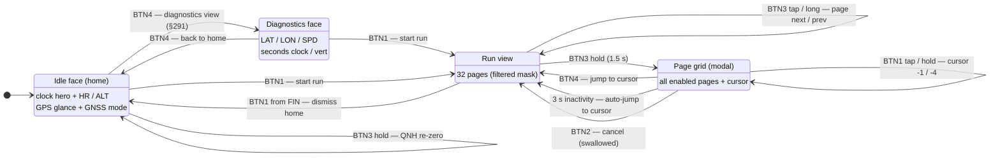

# Navigation map — every state, page, and button edge

The complete navigation graph of the tier-1 watch firmware: which surfaces
exist, every button edge between them, and the measured press-cost of getting
anywhere. Sources of truth: `watch_core::button` (press grammar),
`watch_core::page` (cycle order, §286), `watch_core::page_grid` (the grid
modal, §288/§289), `watch_core::record` (run states), `watch_core::face`
(what each surface renders). Every edge below is host-tested; the flows are
sim-verified (see `apps/custom_watch/local_testing.md` for the macros).

## Mode-level graph

Run sub-states (the tag top-right of every run page): `REC` blinking while
recording (steady through the min-move sampling artifact on slow climbs),
`AUTO` steady during a speed-derived auto-pause (resumes itself), `PAU`
steady only for a manual pause (owes a BTN1 press), `FIN` once stopped
(decisions §287). `BTN1` from `FIN` returns home and the next run opens on
the Dashboard (§289) — before §289, `Finished` was a dead end that held the
run view until reboot. In `FIN` the dead lap key becomes a tap page-back
(§290): the post-run review pages both ways on taps, BTN3 forward and BTN4
backward, with the long-press back still available everywhere. Dismissing
also resets the idle face to the home view, wherever a pre-run BTN4 toggle
left it (§291).

## The page cycle (§286 order, §284 filter)

BTN3 walks this ring — forward on tap, backward on long-press — filtered to
`pages_mask` (data-present ∩ curated, Dashboard always enabled). Clusters
are ordered by mid-run glance frequency; `BACK` (Back-to-start) sits last so
the safety page is exactly one long-press from home.

```mermaid
flowchart LR
    subgraph live [live run]
        DASH --> DIST --> PACE --> LAP --> ZONE --> SPLT --> PACR
    end
    subgraph course [course / race ops]
        NAV --> TURN --> CUT --> ROAD --> FUEL
    end
    subgraph effort [effort analysis]
        ELEV --> PRED --> LOAD --> BAND
    end
    subgraph synced [synced training]
        GEAR --> TPCE --> FITN --> REDY --> GOAL --> RDAY --> PLAN --> ADPT
    end
    subgraph summaries [synced summaries]
        RCAP --> STRK --> STAT --> PR --> SMPL --> RELV --> AEFF
    end
    PACR --> NAV
    FUEL --> ELEV
    BAND --> GEAR
    ADPT --> RCAP
    AEFF --> BACK
    BACK --> DASH
```

The page grid (hold BTN3) shows this same ring as a 4-column map — codes in
cycle order, cursor box on the current page — and moves over it with
`±1` (taps) and `±4` (holds).

## Press cost — measured, from the Dashboard, full 32-page mask

Actions counted: each tap, long-press, or hold is one action; the grid's
open-hold is one; the auto-select close is free (BTN4 costs one to jump
immediately). `linear` = tap-forward / long-back only.

| Mechanism | Worst page | Average |
|---|---|---|
| Linear walk only (pre-§288) | 16 | 8.0 |
| + grid, forward-only movement (§288 as first built) | 9 | 4.7 |
| + grid, symmetric ±1/±4 (§289, shipped) | **6** | **3.7** |

Under a typical filtered mask (~12 pages): worst 4, average ~2.2. The
navigation-graph analysis is what motivated §289's symmetric movement: with
forward-only cursor moves, the cells just *behind* the cursor were the most
expensive on the whole grid (near-full lap), which the `±` grammar removes.

## Invariants (each pinned by a host test)

- **The grid modal swallows every button.** No press inside it can pause,
  stop-arm, or lap the recording; BTN2 cancels, BTN4 confirms, BTN1/BTN3
  move the cursor. The recorder is unreachable from the modal.
- **§286's safety contract stands**: Back-to-start is one long-press from
  the Dashboard, grid or no grid.
- **Dashboard is always enabled** — no mask can empty the cycle or the grid.
- **Auto-select, not auto-cancel**: an abandoned grid jumps to its cursor
  (the one-handed flow); the worst outcome is landing on a page you were
  looking at.
- **Alert banners defer while the grid is open** (their TTL outlives it and
  fuel reminders latch into the persistent row-1 marker); the armed-stop
  banner outranks alerts but yields to the grid, where BTN2 means cancel.
- **Idle gestures are duration-stable**: a BTN3 hold of any length while
  idle is the QNH re-zero — duration never changes an idle gesture
  mid-press.
- **The home face always tells the time** — the 32x48 clock hero
  extrapolates `HH:MM` from the last fix's wall clock plus uptime (UTC —
  tier 1 has no timezone source), and shows an honest `--:--` before any
  fix. The seconds clock and the GPS-less-bench vert row live on the
  diagnostics view (§291).
- **The home clock is minute-resolution** so an idle watch owes the panel
  zero per-second redraws; `draw_bignum_band` compare-writes whole lines, so
  a resting clock flushes zero lines (pinned by a `sharp_mip` test).

## Known gaps (deliberate, tier-1)

- No timezone: the home clock is UTC-labelled until a settings-sync field
  carries an offset.
- `FIN` retains the last run's stats until dismissed — there is no summary
  page beyond the frozen dashboard.
- The home face carries no battery figure — tier 1 has no fuel gauge, so
  the MODE row's projected hours are the only battery signal (§291 shipped
  the clock-hero home face; the bench acquisition view moved behind BTN4).

## Driving it in the sim

`pnpm watch:sim:gui:idle` boots to the home face (no auto-started run). Via
`bin/watch-monitor.sh`: `runMacro $btn1` start / pause / dismiss-home,
`$btn2` twice stop (watch the `STOP? BTN2` banner), `$btn3` page, `$btn3l`
page back, `$btn3h` page grid, then `$btn3`/`$btn3l`/`$btn1` to move the
cursor and `$btn4` to jump. Once stopped (`FIN`), `$btn4` pages back. While
idle, `$btn4` toggles the home face against the diagnostics face.
