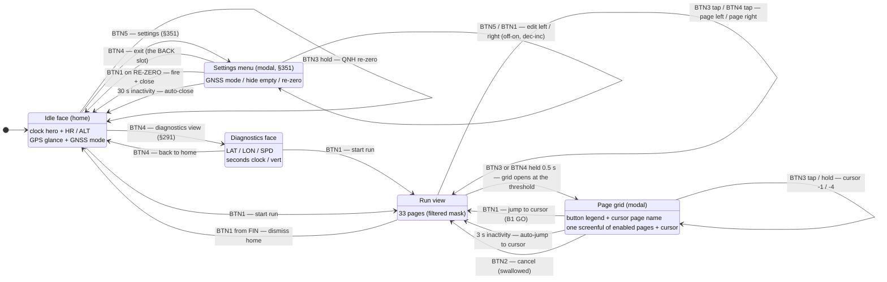

# Navigation map — every state, page, and button edge

The complete navigation graph of the tier-1 watch firmware: which surfaces
exist, every button edge between them, and the computed press-cost of getting
anywhere. Sources of truth: `watch_core::button` (press grammar),
`watch_core::page` (cycle order, §286), `watch_core::page_grid` (the grid
modal, §288/§289/§333), `watch_core::record` (run states), `watch_core::face`
(what each surface renders). Every edge below is host-tested; the flows are
sim-verified (see `apps/custom_watch/local_testing.md` for the macros).

## Mode-level graph

Run sub-states (the tag top-right of every run page): `REC` blinking while
recording (steady through the min-move sampling artifact on slow climbs),
`AUTO` steady during a speed-derived auto-pause (resumes itself), `PAU`
steady only for a manual pause (owes a BTN1 press), `FIN` once stopped
(decisions §287). `BTN1` from `FIN` returns home and the next run opens on
the Dashboard (§289) — before §289, `Finished` was a dead end that held the
run view until reboot. Every run view — recording, paused, finished — pages
the same way: BTN3 tap left, BTN4 tap right (§350, superseding §290's
FIN-only tap-back). Dismissing also resets the idle face to the home view,
wherever a pre-run BTN4 toggle left it (§291).

## The page cycle (§286 order, §284 filter)

The paging pair walks this ring the way it is drawn — the ring renders
horizontally (the top-edge position thumb), so the lower-RIGHT key (BTN4)
taps rightward and the lower-LEFT key (BTN3) taps leftward (§350), and both
walks are filtered to `pages_mask` (data-present ∩ curated, Dashboard always
enabled). Clusters are ordered by mid-run glance frequency; `GUID` (the
scripted coach run) closes the live cluster as the virtual partner's sibling,
and `BACK` (Back-to-start) sits last so the safety page is exactly one
left-tap from home. The curation half of the mask reaches only the first 32
pages: the `SET1` wire field is 32 bits, so `BACK` — discriminant 32 — is the
one page the phone cannot curate out, and `mask_from_wire` leaves it
*enabled* rather than hiding it invisibly on every push (§333). Data presence
still gates it.

```mermaid
flowchart LR
    subgraph live [live run]
        DASH --> DIST --> PACE --> LAP --> ZONE --> SPLT --> PACR --> GUID
    end
    subgraph course [course / race ops]
        NAV --> TURN --> CUT --> ROAD --> FUEL
    end
    subgraph effort [effort analysis]
        ELEV --> PRED --> LOAD --> BAND
    end
    subgraph synced [synced training]
        GEAR --> TPCE --> FITN --> REDY --> GOAL --> RDAY --> PLAN --> ADPT
    end
    subgraph summaries [synced summaries]
        RCAP --> STRK --> STAT --> PR --> SMPL --> RELV --> AEFF
    end
    GUID --> NAV
    FUEL --> ELEV
    BAND --> GEAR
    ADPT --> RCAP
    AEFF --> BACK
    BACK --> DASH
```

The page grid (hold either paging key 0.5 s — it opens at the threshold, so
the grid appearing is the hold's own feedback) shows this same ring as a
4-column map — codes in cycle order, cursor box on the current page — and
moves over it with `±1` (taps) and `±4` (holds), BTN4 forward and BTN3
backward: the same directions the keys page, so the modal never inverts the
spatial mapping. Above the map sit two chrome rows: row 0 is the **button
legend** (`B2 EXIT` … `B1 GO`) and row 1 the **cursor page's full
name** (`Page::name`, longest `ELEVATION PROFILE` at 17 of 21 cells). The body
therefore seats `GRID_CAPACITY` = 4 × 7 = 28 cells against a 33-page ring, so it
is a **window** that scrolls in whole rows to keep the cursor's row on screen
rather than truncating the tail (§333) — scroll depth 2 at the full mask. Under
the everyday filtered mask (~12 pages, 3 rows) the whole enabled set fits and
nothing scrolls.

The chrome is what makes the modal honest about itself. 33 codes need
`ceil(33/4)` = 9 rows and the panel has exactly 9 (144 px / 16 px), so there was
never a spare row — every chrome row is bought from body capacity, which only
§333's window makes affordable (before it the body was a hard 32-cell `const`
assert). Row 0 names BTN2 and BTN1 and deliberately **not** BTN3/BTN4: a paging
press moves the visible cursor one cell in the direction it always pages and
commits nothing, so it is discovered for free, whereas BTN2 — which arms the
stop everywhere else and cancels in here — is a *safety* remap the closing grid
cannot reveal (§337), and `B1 GO` names the confirm because a START-key jump is
learned from other watches, not from this screen.

## The settings menu (idle, §351 — directional key map)

A BTN5 tap on the idle face opens it — the lap key is dead while idle, the
same dead-key repurposing as §290/§291. Inside, every key is spatially true
to the case:

- **BTN2 / BTN3** — cursor **up / down** the list. These are the §81 slots
  Garmin literally names UP and DOWN, stacked vertically on the left of the
  case.
- **BTN5 / BTN1** — edit the selected row, **left / right**: left = off /
  decrease, right = on / increase, and right fires an action row. Edits are
  directional and idempotent — HIDE EMPTY is right=ON / left=OFF (the side
  you want, never an overshootable toggle), GNSS MODE is a clamped ladder
  (right toward Expedition and more hours, left toward Performance and more
  fixes, no wrap) with the projected hours read *before* committing.
- **BTN4** — **exit**, on the §81 BACK slot, where every five-button watch
  puts it.

Three items at tier 1: **GNSS MODE**, **HIDE EMPTY** (the §284 filter; the
full per-page mask stays a phone surface), **RE-ZERO ALTITUDE** (right fires
the idle hold's request and closes; the idle banner answers). Value rows keep
the menu open — the row re-rendering with the new value is the confirmation.
Every press inside is swallowed, the menu is idle-only, and 30 s of
inactivity closes it because it covers the home clock. The GNSS mode and the
hide-empty choice both persist in the CFG1 flash record and restore at boot —
whichever side wrote last, menu or phone push, wins the reboot.

The menu's key map deliberately diverges from the grid's (BTN3/BTN4 cursor,
`B1 GO`, `B2 EXIT`): the grid walks the *horizontal* page ring, so its cursor
rides the paging pair; a settings list is *vertical* with a value axis across
each row, so its cursor rides the vertical pair and its edits the horizontal
one. Each modal is true to what it shows. The one §337-class surprise — EXIT
living on B4 here but B2 there — is what the menu's legend row names
(`B5- B1+       B4 EXIT`); the cursor keys move a visible marker and stay
unlabelled.

## Every interaction, priced

The §350/§351 audit: what everything on the device costs, and whether that
is the floor. "Floor" for a single discrete action is one press; for
select-1-of-33 it is what the §289 BFS model computes for a five-key,
no-chord grammar.

| Interaction | Cost | At floor? |
|---|---|---|
| Start a run (idle) | 1 tap (BTN1) | yes |
| Pause / resume | 1 tap (BTN1) | yes |
| Manual lap | 1 tap (BTN5) | yes |
| Stop | 2 taps (BTN2 ×2, 4 s window) | **deliberately +1** — the §-StopGuard trade: one extra press vs. a brushed sleeve ending a 100-mile recording |
| Dismiss a finished run | 1 tap (BTN1) | yes |
| Page one step left / right | 1 tap (BTN3 / BTN4) | yes |
| Any of 33 pages | ≤ 6 actions, avg 3.8 (table below); ≤ 4 / ~2.2 on a typical curated mask | computed optimum for the grammar |
| Open the page grid | 1 hold (0.5 s, either paging key) | yes |
| GNSS mode, quick path | 1 tap per step (idle BTN3) | yes |
| QNH re-zero, quick path | 1 hold (idle BTN3) | yes |
| Diagnostics view | 1 tap (idle BTN4) | yes |
| Open settings | 1 tap (idle BTN5) | yes |
| Change any setting via the menu | ≤ 4 (open + ≤ 2 cursor steps + 1 edit press); exit is free (30 s) or 1 (BTN4) | — |

Everything that can be one press is one press; the only interaction above
its floor is the stop, on purpose. The remaining lever on the page-cycle
average is the phone-side mask curation (§284), which is a content decision,
not a grammar one.

## Press cost — computed, from the Dashboard, full 33-page mask

Actions counted: each tap or hold is one action; the grid's open-hold is one;
the auto-select close is free (BTN1 costs one to jump immediately). `linear` =
the bidirectional tap walk (BTN4 right / BTN3 left). The grid rows are
**additive**: the bidirectional walk does not go away when the grid arrives, so
a page costs the cheaper of the two routes — which is why no grid row can be
worse than the linear row, and why the grid's own worst *cell* is not the worst
*page*.

| Mechanism | Worst page | Average |
|---|---|---|
| Linear walk only (pre-§288) | 16 | 8.2 |
| + grid, forward-only movement (§288 as first built) | 9 | 4.8 |
| + grid, symmetric ±1/±4 (§289; §350 keys) | **6** | **3.8** |

Every figure is **computed from the cycle and cursor rules, not hand-measured**:
a breadth-first search over the cursor's move set on the enabled cycle
(`{+1, +4}` forward-only, `{±1, ±4}` symmetric, `GRID_COLS` the row stride),
each page then taking `min(walk, 1 + grid moves)` with `walk = min(k, n-k)`, and
the average over all `n` pages with the current page at zero. The model is
validated by reproducing the pre-page-33 table exactly at `n = 32` — 16 / 8.0,
9 / 4.7188, 6 / 3.7188 — so the table above re-derives the original measurement
at the new page count rather than replacing it with a fresh estimate. Both grid
worsts survive page 33 unchanged; the averages move 4.7188 → 4.8182 and
3.7188 → 3.7576. The linear worst stays 16 because the page 17 steps forward is
16 taps back.

**§350 does not move these counts — it moves their price in seconds.** The
action *counts* are identical under the spatial grammar (the walk was already
bidirectional, the grid moves are the same set), but a backward step is now a
plain tap instead of a 0.5 s timed hold, and the grid-open hold fires at 0.5 s
instead of 1.5 s — so the worst page costs 6 *taps-or-short-holds*, with no
gesture in the chain longer than half a second.

**§333's row-scrolling window does not enter this table.** `window_origin_row`
decides which cells are on screen; it never changes what a cursor move does, so
an off-window cell costs exactly what an on-window one costs. Nor does the wider
`u64` mask. What *had* looked like a stale grid row was a modelling gap: treat
the grid as *replacing* the walk rather than joining it and the forward-only row
comes out at worst 11, because the runner is denied the single long-press that
reaches the tail. The walk was the missing term.

Under a typical filtered mask (~12 pages), same model: worst 4, average ~2.2
(26/12). The navigation-graph analysis is what motivated §289's symmetric
movement: with forward-only cursor moves, the cells just *behind* the cursor
were the most expensive on the whole grid (near-full lap), which the `±` grammar
removes.

## Invariants (each pinned by a host test)

- **The paging taps mirror spatially in every run view** (§350). BTN3's tap
  is `PagePrev` and BTN4's tap is `PageNext` in recording, paused, and
  finished alike — no state may bend either tap to anything else, and the
  grid cursor moves the same directions, so left always means left.
- **The grid modal swallows every button.** No press inside it can pause,
  stop-arm, or lap the recording; BTN2 cancels, BTN1 confirms, BTN3/BTN4
  move the cursor, BTN5 is swallowed whole. The recorder is unreachable from
  the modal.
- **The grid states its own button map** (§337). Row 0 carries `B2 EXIT` and
  `B1 GO` — the two presses that leave the modal — so BTN2's loss of the stop is
  read, not discovered; the run view's `STOP? BTN2` banner picks the chain up on
  the other side. The legend is static, so it can never dirty a panel line.
- **No jump commits off a code alone** (§337). Row 1 spells out the cursor
  page's full name, because four glyphs cannot separate 33 pages: `LOAD`/`ROAD`
  and `PACE`/`PACR` are one Levenshtein edit apart and `REDY`/`RDAY` and
  `PACR`/`RCAP` are transpositions (computed over all 528 code pairs; 24 more sit
  at distance 2). Both the 3 s auto-select and BTN1 therefore commit on
  something the runner has read.
- **No cell can land on the chrome rows** — the cursor box is drawn from
  `GRID_TOP_ROW`, and `window_origin_row` derives from `GRID_BODY_ROWS`, so
  spending a row on chrome shortens the window and never displaces the cursor.
- **§286's safety contract stands, cheaper**: Back-to-start is one BTN3 tap
  from the Dashboard (it was one long-press before §350), grid or no grid.
- **Dashboard is always enabled** — no mask can empty the cycle or the grid.
- **The page-position thumb partitions the top edge.** `statusbar::page_thumb`
  gives the active page the half-open segment
  `[active * 168 / total, (active + 1) * 168 / total)`, so the enabled pages own
  every track column between them exactly once: the Dashboard's thumb is flush
  left and the ring's last page flush right at *every* page count, which is the
  glanceable "the next tap wraps". Deriving the width from a separately
  truncated `168 / total` stranded the remainder columns — at 33 pages that was
  55, 111 and 167, so the last page fell a pixel short of the edge while every
  count dividing 168 (12, 3, 2) tiled correctly and hid it.
- **Auto-select, not auto-cancel**: an abandoned grid jumps to its cursor
  (the one-handed flow); the worst outcome is landing on a page you were
  looking at.
- **Alert banners defer while the grid is open** (their TTL outlives it and
  fuel reminders latch into the persistent row-1 marker); the armed-stop
  banner outranks alerts but yields to the grid, where BTN2 means cancel.
- **Idle gestures are duration-stable**: a BTN3 hold of any length while
  idle is the QNH re-zero, and BTN4 toggles the diagnostics view whatever
  its duration — duration never changes an idle gesture's meaning
  mid-press.
- **The settings menu swallows every button and exists only while idle**
  (§351). No press inside it can start, pause, or lap a run; a run starting
  under it (sim-autostart) closes it; edits are directional and idempotent
  (a clamped ladder end or an on/on press is a no-op, never an overshoot);
  and its legend names exactly what §337 demands — the exit that moved off
  the grid's B2, and the novel edit pair. Its 30 s auto-close is a per-press
  deadline, never a standing wake, and exists because the menu covers the
  home clock.
- **A hold's action fires at its threshold, not on release** (§350). At
  0.5 s of a run-view paging hold the grid simply opens under the thumb —
  the modal appearing IS the feedback — so no gesture asks the runner to
  time a release blind. This is what §334's `GRID? HOLD` banner existed to
  patch: it announced the boundary between the page-back tier and the grid
  tier, and §350 deleted the middle tier, so the banner went with it —
  there is no longer any timed boundary a hand has to feel for.
- **The home face always tells the time** — the 32x48 clock hero
  extrapolates `HH:MM` from the last fix's wall clock plus uptime, and shows
  an honest `--:--` before any fix. Local time once a settings push has
  carried the phone's auto-sourced timezone offset (§293), UTC until then —
  the row-7 label (`UTC` / `LOCAL`) derives from the same input as the hero,
  so it always says which. The seconds clock and the GPS-less-bench vert row
  live on the diagnostics view (§291), deliberately unshifted: raw receiver
  UTC is a feature on the bench.
- **The home clock is minute-resolution** so an idle watch owes the panel
  zero per-second redraws; `draw_bignum_band` compare-writes whole lines, so
  a resting clock flushes zero lines (pinned by a `sharp_mip` test).

## Known gaps (deliberate, tier-1)

- The grid's 3 s auto-select still commits the cursor with no countdown on
  screen — the one timed wait left without pre-fire feedback. A countdown
  inside the grid would need a per-second wake for as long as the modal is
  open, which §328 rules out.

- The timezone offset is static between pushes: a DST transition or a border
  crossing shifts the home clock only after the phone's next settings push
  (§293) — the watch has no zoneinfo of its own.
- `FIN` retains the last run's stats until dismissed — there is no summary
  page beyond the frozen dashboard.
- The home face's battery icon is a rest-voltage estimate off the SAADC's
  internal VDD channel (§294), not a fuel gauge: a loaded cell sags below the
  curve anchors, and it yields the title row's mid-band to the post-press
  BTN3 hint and the re-zero banner. The numeric `BAT n%` is diagnostics-only.
  A rail the plausibility band can't read as a 1S LiPo — the USB-powered DK
  at ~3.0 V — shows nothing at all rather than a confident 0 %.

## Design research — why the paging keys sit where they do (§350)

What the five-button brands actually do, checked against their manuals: a
Garmin Fenix pages data screens with UP/DOWN on the **left** side; a Polar
Vantage browses training views with UP/DOWN on the **right** side (OK, the
right-middle key, marks a lap; BACK, lower-left, pauses); a Suunto Vertical
scrolls with the upper/lower of its three **right**-side buttons. Three
brands, three placements — but all of them stack prev/next *vertically on
one side*, because their page metaphor is a vertical list. No mainstream
watch splits paging across the case. Ours does, deliberately: this UI's
page ring is drawn *horizontally* (the §-invariant top-edge position thumb
sweeps left→right across the cycle), and stimulus-response compatibility —
the classic human-factors result that a control congruent with the
display's motion is faster and less error-prone, especially under load —
says the leftward key belongs on the left of the case and the rightward key
on the right. The §81 asymmetric 3+2 shape is kept (case, tooling, the
learned silhouette); what §350 reassigns is the slot *functions*: paging on
the two lower corners where the metaphor puts them, start/pause staying
upper-right (every brand's START), stop staying mid-left behind its
two-press guard, and the lap on the upper-left fifth key — Polar's
precedent that a lap deserves its own dedicated, undelayed tap.

## Driving it in the sim

`pnpm watch:sim:gui:idle` boots to the home face (no auto-started run). Via
`bin/watch-monitor.sh`: `runMacro $btn1` start / pause / dismiss-home,
`$btn2` twice stop (watch the `STOP? BTN2` banner), `$btn4` page right,
`$btn3` page left, `$btn3h` or `$btn4h` page grid (0.8 s — it opens at the
0.5 s threshold, mid-hold), then `$btn3`/`$btn4` to move the cursor
backward / forward and `$btn1` to jump (`B1 GO`), `$btn5` lap. The same
grammar in `FIN`: `$btn4` right, `$btn3` left. While idle, `$btn4` toggles
the home face against the diagnostics face, `$btn3h` is the QNH re-zero,
and `$btn5` opens the settings menu (`$btn2`/`$btn3` cursor up/down,
`$btn5`/`$btn1` edit left/right, `$btn4` exit). Or click the bezel buttons
in the `--gui` window — they sit at the §81 positions (BTN5 upper-left,
BTN2 mid-left, BTN3 lower-left, BTN1 upper-right, BTN4 lower-right).
